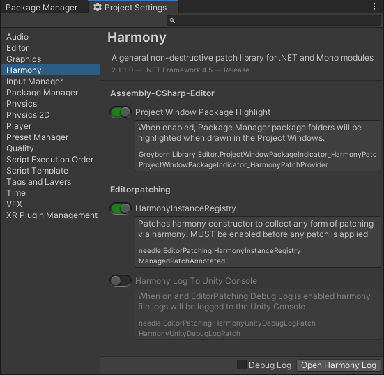

# Harmony Editor Patching

This project is forked from [needle-tools/editorpatching](https://github.com/needle-tools/editorpatching).

***It currently depends on private library references, and direct use is not recommended. The original Needle project is recommended over this one.***

While it includes mostly aesthetic tweaks, there are a few fixes:

- `EditorPatchProvider` patch state is now saved correctly.
- The "ping" method now attempts to locate the patch file, assembly, or package before generating a failure log message.

Aesthetic changes include:
- Harmony assembly infomation now appears in the panel header.
- Patch metadata was moved from a tooltip to a featured box below the patch name.
- Patch name functions as a button to ping the patch file or assembly, and the mouse cursor now changes when hovering over the label.
- The location of the provider in the Project Settings window changed from "Needle/Editor Patching" to "Harmony".
- The settings filename changed "EditorPatchingSettings" to "HarmonyPatchSettings".



> **NOTE**: The `SlideToggle` control is from a package that's currently in a private registry. While it will likely be made public at some point, in the meantime, the control could easily be replaced with another control, such as `GUI.Toggle(rect, oldValue, string.Empty)`).


-----

# Original README

## How to Install

<details>
<summary>Add from OpenUPM <em>| via scoped registry, recommended</em></summary>

This package is available on OpenUPM: https://openupm.com/packages/com.needle.editorpatching  

To add it the package to your project:

- open `Edit/Project Settings/Package Manager`
- add a new Scoped Registry:
  ```
  Name: OpenUPM
  URL:  https://package.openupm.com/
  Scope(s): com.needle
  ```
- click <kbd>Save</kbd>
- open Package Manager
- click <kbd>+</kbd>
- select <kbd>Add from Git URL</kbd>
- paste `com.needle.editorpatching`
- click <kbd>Add</kbd>
</details>

<details>
<summary>Add from GitHub | <em>not recommended, no updates through PackMan</em></summary>

You can also add it directly from GitHub on Unity 2019.4+. Note that you won't be able to receive updates through Package Manager this way, you'll have to update manually.

- open Package Manager
- click <kbd>+</kbd>
- select <kbd>Add from Git URL</kbd>
- paste `https://github.com/needle-tools/editorpatching.git?path=/package`
- click <kbd>Add</kbd>
</details>

## Contact ✒️
<b>[🌵 needle — tools for unity](https://needle.tools)</b> • 
[@NeedleTools](https://twitter.com/NeedleTools) • 
[@marcel_wiessler](https://twitter.com/marcel_wiessler) • 
[@hybridherbst](https://twitter.com/hybridherbst)
